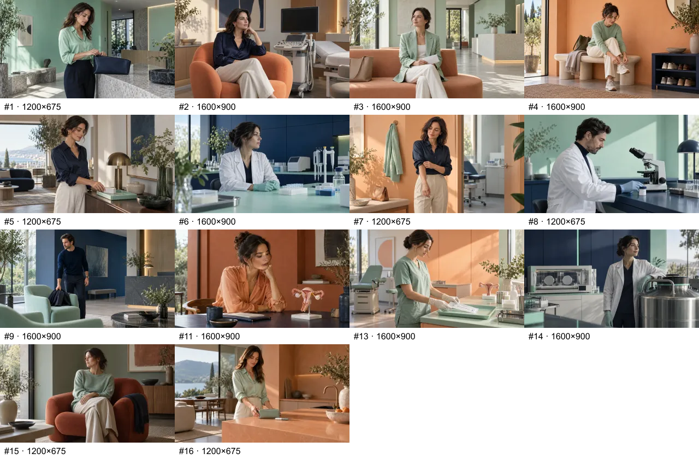
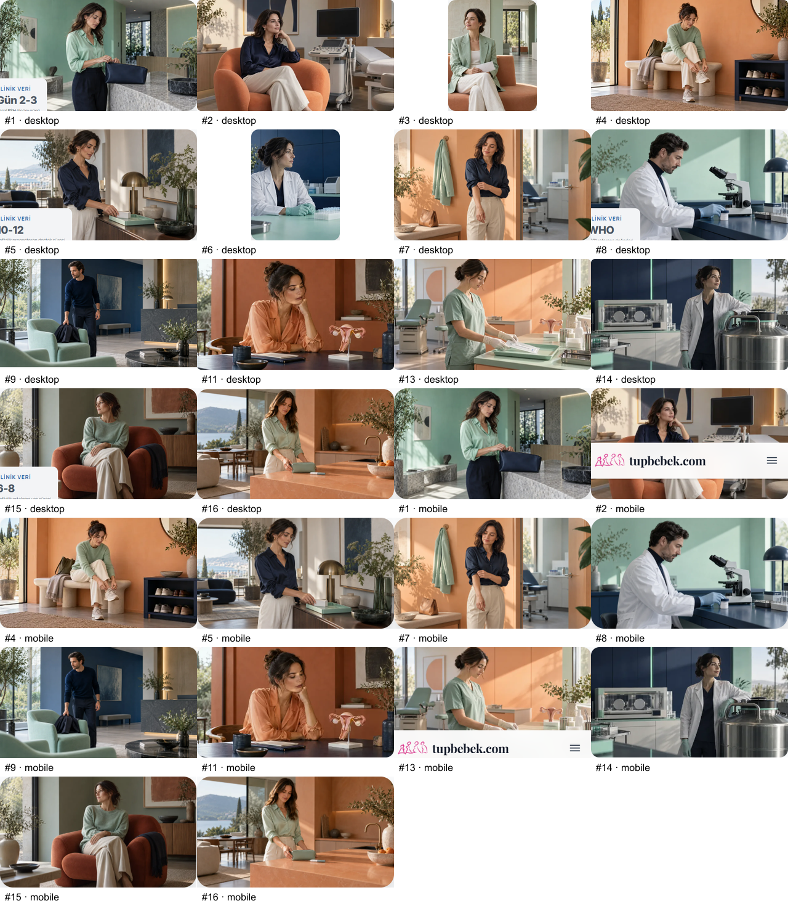

# P0 uygulama ve doğrulama — 26 Eylül 2026

Onaylanan 14 aktif görsel aynı adreslerde yeni Vogue/editoryal fotoğraf sahneleriyle değiştirildi. Beş makale kapağı, iki hub hero'su, ana sayfa kartı ve altı gövde görseli yer alıyor. Kullanılmayan eski #10 ve #12 dosyalarına dokunulmadı. Mevcut yeni kapaklara geri bağlantı verilmedi.

## Uygulama

- Hero/master: 1600×900; gövde: 1200×675 WebP. Sharp quality 83 / effort 6. Sahneye bulanık bant eklenmedi.
- Alt metinler çıkan sahneyle eşleştirildi; gövde fotoğrafları figure/figcaption aldı. AI üretimi açıkça belirtildi. Hub portreleri 4:5 alanı dolduruyor; marka paleti grayscale kaldırılarak korunuyor.
- 24 makalede inceleyen adı/rolü `tupbebek.com Editöryal Ekip` / `Tıbbi Yayın Ekibi` oldu. 63 makalenin tümü bu standartla tutarlı. Mevcut inceleme tarihleri, onay alanları ve gerçek uzman katkıları korundu.
- Methodology koleksiyondan 63 yayımlanmış makale sayıyor; 100+ ve klinik deneyim reklamı kaldırıldı. Evrensel kurul onayı iddiası yerine sayfa künyelerine yönlendiren açıklama var.
- Menüdeki IVF %40–50, cerrahi sonrası %30–40 ve yaşam tarzı %25 artış nesneleri kaldırıldı.

## Doğrulama

- `npm run build`: exit 0, postbuild ve Pagefind tamamlandı; 63 makale indekslendi.
- `npm run verify:preflight`: exit 0, 23/23 geçti.
- 63 makale HEAD ile karşılaştırıldı: yalnızca onaylanan inceleyen ve görsel metadata alanları değişti. Gövde, tarihler, kaynaklar ve uzman katkıları aynı.
- Prebuild sonrası kaynak sürüklenmesi yok. Manifest gerçek dosya boyutlarını içeriyor; kapakların 640/960/1280 türevleri üretildi.
- Önceki dist ile 99 sayfanın route, H1, SEO title ve canonical değerleri eşit.
- 14 sayfa masaüstü 1366×900 ve mobil 390×844 üzerinde çekildi. Son render kaydında yüklenemeyen görünür görsel, sayfa JS hatası ve yatay taşma yok.
- 28 görsel/viewport durumu ayrıca kontrol edildi: 26 fotoğraf görünür/yüklü; iki hub hero'su tasarım gereği mobilde gizli. Alt metin ve intrinsic boyutlar doğru.
- `git diff --check` geçti.

## Kanıt dosyaları ve sınırlar

- [Üretim/prompt kaydı](P0-GORSEL-URETIM-KAYDI.json), [sayısal doğrulama](P0-DOGRULAMA.json), [render görsel kontrolü](P0-RENDER-GORSEL-KONTROL.json).
- Yerel tam ekranlar: `.tmp/p0-before/{desktop,mobile}/` ve `.tmp/p0-after-final/{desktop,mobile}/`. İlk önce görüntüleri çerez penceresini içerir; son görüntüler UI üzerinden reddedildikten sonra alındı. Kırpma sayfası son render'ı gösterir. Bunlar gerçek yerel çekimlerdir.
- İlk uygulama içi tarayıcı denemesi native bridge güven hatası verdi; projenin Puppeteer aracı kullanıldı. Lazy-load için kaydırma 60 ms'den 250 ms'ye çıkarıldı; görünür görsellerin decode işlemi beklendi.
- Tam kaynak PNG'ler Codex üretim klasöründe; seçilen son WebP'ler repoda. Tam ekranların tamamı yerelde tutulur, toplu kırpma ve görsel sayfaları PR'da incelenebilir.
- Build, mevcut Cloudflare adaptörü / Sharp servis uyumu uyarısını veriyor; süreç başarıyla sona erdi ve statik dosyalar yüklendi. Bu çalışma adaptör ayarını değiştirmiyor.
- P1 kapak yenilemeleri ayrı kapsamdır. Bu kayıt tıbbi iddiaların bütün site çapında yeniden kaynak denetimi yapıldığı anlamına gelmez.
- Canlı custom-domain sürümü bu değişiklikleri içermiyor. Merge/deploy ayrı yayın onayı bekler; doğru hedef yalnızca `tupbebek`.
